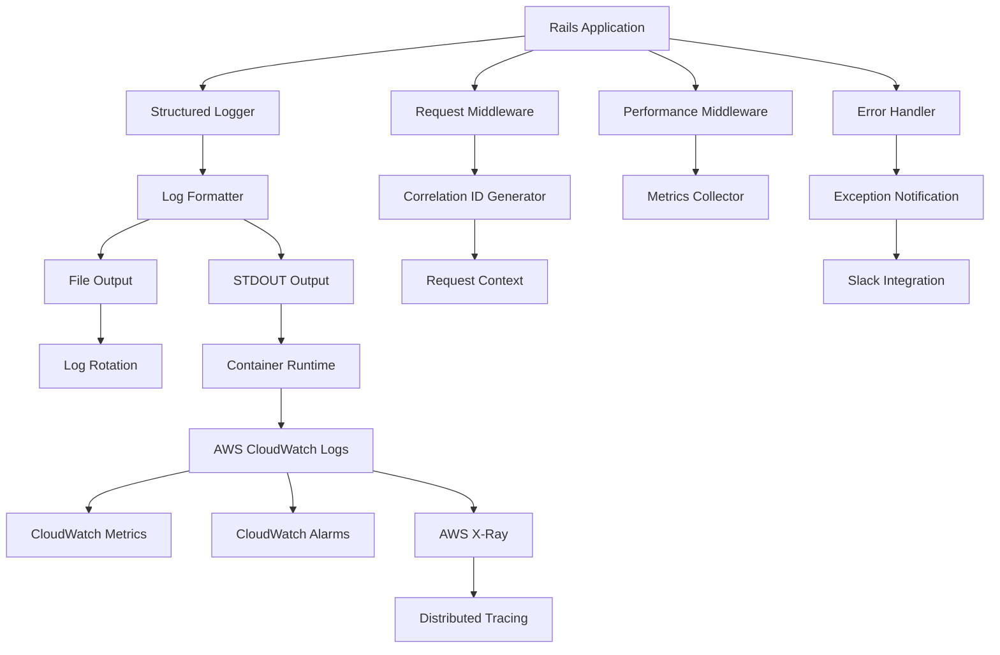

# 設計書

## 概要

この設計書では、RailsアプリケーションにAWSを前提とした包括的なログ基盤を実装します。構造化ログ、パフォーマンス監視、エラートラッキング、相関ID追跡を含む統合ログシステムを構築し、AWS CloudWatch、X-Ray、CloudWatch Alarmsとの連携を実現します。

## アーキテクチャ

### 全体アーキテクチャ



### ログフロー

1. **リクエスト受信**: 相関IDの生成とコンテキスト設定
2. **処理実行**: 各コンポーネントでの構造化ログ出力
3. **ログ集約**: ファイルとSTDOUTへの同時出力
4. **AWS転送**: CloudWatch Logsへの自動転送
5. **監視・アラート**: メトリクス抽出とアラーム設定

## コンポーネントと インターフェース

### 1. 構造化ロガー (`LoggingInfrastructure::StructuredLogger`)

```ruby
class LoggingInfrastructure::StructuredLogger
  def initialize(level: :info, output: STDOUT)
  def info(message, **metadata)
  def warn(message, **metadata)
  def error(message, **metadata)
  def debug(message, **metadata)
  
  private
  def format_log(level, message, metadata)
  def filter_sensitive_data(data)
end
```

**責任:**
- JSON形式でのログ出力
- 機密データの自動フィルタリング
- メタデータの構造化

### 2. リクエストミドルウェア (`LoggingInfrastructure::RequestMiddleware`)

```ruby
class LoggingInfrastructure::RequestMiddleware
  def call(env)
  
  private
  def generate_correlation_id
  def extract_request_metadata(request)
  def log_request_start(metadata)
  def log_request_end(metadata, response, duration)
end
```

**責任:**
- 相関IDの生成と設定
- リクエスト開始/終了のログ記録
- レスポンス時間の測定

### 3. パフォーマンス監視 (`LoggingInfrastructure::PerformanceMonitor`)

```ruby
class LoggingInfrastructure::PerformanceMonitor
  def self.track_database_query(sql, duration, connection_info)
  def self.track_cache_operation(operation, key, hit, duration)
  def self.track_external_api_call(url, method, duration, status)
  def self.track_memory_usage
  
  private
  def self.log_performance_metric(type, data)
end
```

**責任:**
- データベースクエリのパフォーマンス追跡
- キャッシュ操作の監視
- 外部API呼び出しの記録
- メモリ使用量の監視

### 4. エラーハンドラー (`LoggingInfrastructure::ErrorHandler`)

```ruby
class LoggingInfrastructure::ErrorHandler
  def self.handle_exception(exception, context = {})
  def self.log_security_event(event_type, details)
  def self.log_suspicious_activity(user_id, activity_type, details)
  
  private
  def self.extract_error_context(exception)
  def self.should_alert?(exception)
  def self.send_slack_notification(exception, context)
end
```

**責任:**
- 例外の構造化ログ記録
- セキュリティイベントの記録
- 疑わしいアクティビティの検出
- 既存のNotifier::Slackを使用したSlack通知送信

### 5. 相関ID管理 (`LoggingInfrastructure::CorrelationId`)

```ruby
class LoggingInfrastructure::CorrelationId
  def self.current
  def self.set(id)
  def self.generate
  def self.with_id(id, &block)
  
  private
  def self.thread_local_key
end
```

**責任:**
- 相関IDのスレッドローカル管理
- リクエスト間での相関ID継承
- バックグラウンドジョブでの相関ID維持

## データモデル

### ログエントリ構造

```json
{
  "timestamp": "2025-01-08T10:30:00.123Z",
  "level": "info",
  "message": "Request completed",
  "correlation_id": "req_abc123def456",
  "user_id": 12345,
  "session_id": "sess_xyz789",
  "request": {
    "method": "POST",
    "path": "/api/users",
    "ip": "192.168.1.100",
    "user_agent": "Mozilla/5.0...",
    "params": {
      "filtered": true
    }
  },
  "response": {
    "status": 201,
    "duration_ms": 245.67,
    "size_bytes": 1024
  },
  "database": {
    "query_count": 3,
    "total_duration_ms": 45.23
  },
  "memory": {
    "usage_mb": 128.5,
    "gc_count": 2
  },
  "environment": "production",
  "service": "rails-app",
  "version": "1.2.3"
}
```

### パフォーマンスメトリクス構造

```json
{
  "timestamp": "2025-01-08T10:30:00.123Z",
  "level": "info",
  "message": "Database query executed",
  "correlation_id": "req_abc123def456",
  "metric_type": "database_query",
  "metric_data": {
    "sql": "SELECT * FROM users WHERE id = ?",
    "duration_ms": 12.34,
    "connection_pool": {
      "size": 5,
      "available": 3,
      "waiting": 0
    },
    "table": "users",
    "operation": "select"
  }
}
```

## エラーハンドリング

### エラー分類

1. **システムエラー**: 500系エラー、データベース接続エラー
2. **アプリケーションエラー**: ビジネスロジックエラー、バリデーションエラー
3. **セキュリティエラー**: 認証失敗、不正アクセス試行
4. **パフォーマンスエラー**: タイムアウト、メモリ不足

### エラーログ構造

```json
{
  "timestamp": "2025-01-08T10:30:00.123Z",
  "level": "error",
  "message": "Database connection failed",
  "correlation_id": "req_abc123def456",
  "error": {
    "class": "ActiveRecord::ConnectionNotEstablished",
    "message": "could not connect to server",
    "backtrace": ["app/models/user.rb:15", "..."],
    "fingerprint": "db_connection_error_001"
  },
  "context": {
    "user_id": 12345,
    "controller": "UsersController",
    "action": "create",
    "params": {"filtered": true}
  },
  "severity": "critical",
  "alert_sent": true
}
```

### アラート設定

- **Critical**: システム停止、データベース接続失敗 → Slack通知 + CloudWatch Alarm
- **High**: 高エラー率、パフォーマンス劣化 → Slack通知 + CloudWatch Alarm
- **Medium**: セキュリティイベント、異常なユーザー行動 → Slack通知
- **Low**: 警告レベルのイベント → ログのみ

### Slack通知統合

既存の`Notifier::Slack`クラスを活用してエラー通知を送信：

```ruby
# LoggingInfrastructure::ErrorHandler内での使用例
def self.send_slack_notification(exception, context)
  return unless should_send_slack_alert?(exception)
  
  notifier = Notifier::Slack.new
  message = format_slack_message(exception, context)
  notifier.send(message)
rescue => e
  # Slack通知の失敗はログに記録するが、元の処理は継続
  Rails.logger.error("Failed to send Slack notification: #{e.message}")
end

private

def self.format_slack_message(exception, context)
  {
    text: "🚨 Application Error Detected",
    attachments: [
      {
        color: severity_color(exception),
        fields: [
          { title: "Error", value: exception.class.name, short: true },
          { title: "Message", value: exception.message, short: true },
          { title: "Correlation ID", value: context[:correlation_id], short: true },
          { title: "User ID", value: context[:user_id], short: true },
          { title: "Controller", value: "#{context[:controller]}##{context[:action]}", short: true },
          { title: "Environment", value: Rails.env, short: true }
        ],
        ts: Time.current.to_i
      }
    ]
  }
end
```

## テスト戦略

### 単体テスト

1. **StructuredLogger**: ログフォーマット、フィルタリング機能
2. **CorrelationId**: ID生成、スレッドローカル管理
3. **PerformanceMonitor**: メトリクス収集、閾値判定
4. **ErrorHandler**: 例外処理、アラート判定

### 統合テスト

1. **ミドルウェア統合**: リクエスト処理フロー全体
2. **バックグラウンドジョブ**: 相関ID継承
3. **外部API連携**: CloudWatch Logs送信
4. **アラート機能**: 通知システム連携

### システムテスト

1. **エンドツーエンド**: ユーザーリクエストからログ出力まで
2. **パフォーマンス**: 高負荷時のログ出力性能
3. **障害シナリオ**: ログシステム障害時の動作
4. **AWS連携**: CloudWatch、X-Rayとの統合

### テストデータ

```ruby
# spec/support/logging_helpers.rb
module LoggingHelpers
  def with_structured_logging
    original_logger = Rails.logger
    test_logger = LoggingInfrastructure::StructuredLogger.new(output: StringIO.new)
    Rails.logger = test_logger
    yield test_logger
  ensure
    Rails.logger = original_logger
  end
  
  def expect_log_entry(logger, level:, message:, **metadata)
    # ログエントリの検証ヘルパー
  end
end
```

## AWS統合設定

### CloudWatch Logs設定

```yaml
# config/aws_logging.yml
production:
  cloudwatch:
    log_group: "/aws/rails/myapp-production"
    log_stream: "rails-app-#{ENV['HOSTNAME']}"
    region: "ap-northeast-1"
    retention_days: 30
    
development:
  cloudwatch:
    enabled: false
    
test:
  cloudwatch:
    enabled: false
```

### X-Ray統合

```ruby
# config/initializers/xray.rb
if Rails.env.production?
  require 'aws-xray-sdk'
  
  XRay.configure do |config|
    config.name = 'rails-app'
    config.sampling_rate = 0.1
    config.context_missing = :log_error
  end
  
  Rails.application.middleware.insert 0, XRay::Rack::Middleware
end
```

### CloudWatch Alarms設定

```json
{
  "error_rate_alarm": {
    "metric_name": "ErrorRate",
    "threshold": 5.0,
    "comparison": "GreaterThanThreshold",
    "evaluation_periods": 2,
    "period": 300
  },
  "response_time_alarm": {
    "metric_name": "ResponseTime",
    "threshold": 2000,
    "comparison": "GreaterThanThreshold",
    "evaluation_periods": 3,
    "period": 300
  }
}
```